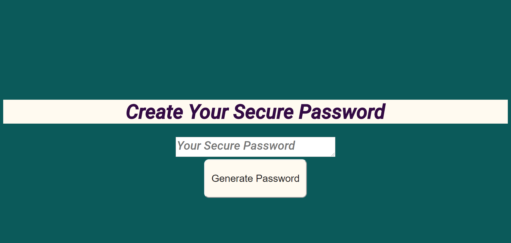
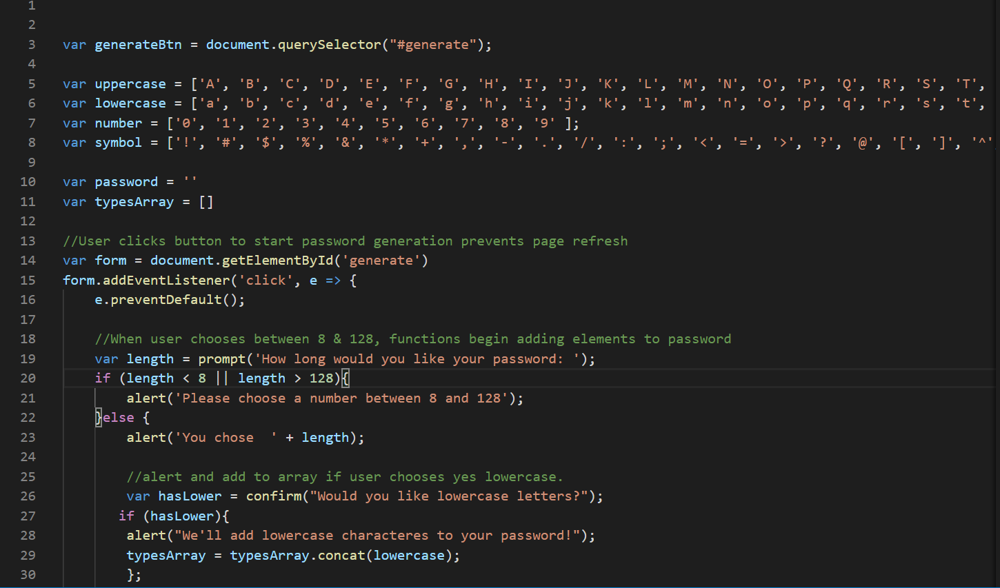

# Secure-Password-Generation
Wk 3 Intro to JavaScript password generator

## Generate Secure Random Password
This page will generate a password based on user choices.

## Goals
*Generate password button results in prompt to user.

*Prompt select how long the password is. Between 8 and 128 characters long.

*Once length is chosen, a series of prompts give input choice for characters and returns an alert confirmation of choice.

*After all prompts are completed, a password with randomized chosen characters will appear in text box in HTML.

## Future Improvements
If user inputs something other than a number, there needs to be a response to enter only numbers.

## Technologies
Basic HTML, CSS, and my first encounter creating a JavaScript file.
Major shoutout to my classmate Jo Mengis who saw a small change that made the difference between my code running and not.

